You have questions about your data. What pages on your website contain a specific word or phrase? What events were logged most recently? What processes take longer than 500 milliseconds to respond?

With Discover, you can quickly search and filter your data. You can get information about the structure of the fields in your data. You can also customize and save your searches and place them on a dashboard.

In Lab 1, you will get hands-on experience using Discover to learn about the data in the lab environment.  You can find Discover's online documentation here: https://www.elastic.co/guide/en/kibana/current/discover.html.

## Discover Overview
===
Kibana requires a data view to access your Elasticsearch data. A data view can point to one or more indices, data streams, or index aliases. When adding data to Elasticsearch using one of the many integrations available, sometimes data views are created automatically, but you can also create your own.

### Data View
Select the data view (backed by an Elasticsearch index) to choose which set of data you want to analyze.
<details>
	<summary>Hint</summary>
	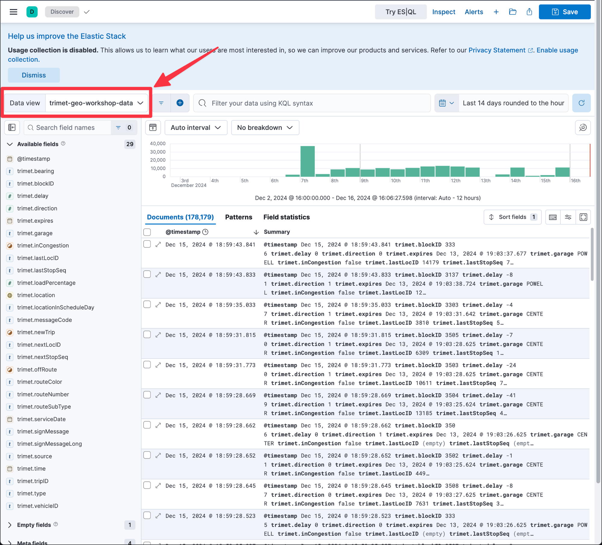
</details>

### Time Picker
Select the time range to narrow your view of the data based on date and time.
<details>
	<summary>Hint</summary>
	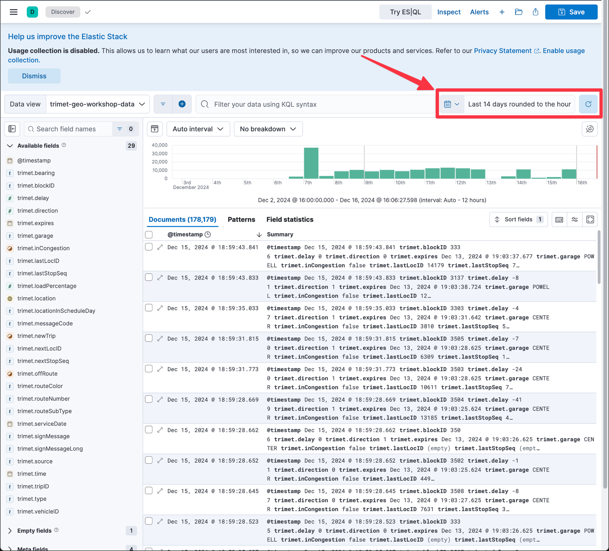
</details>

### Search Box
You can query for basic terms, fields and a combination of the both in the search box.
<details>
	<summary>Hint</summary>
	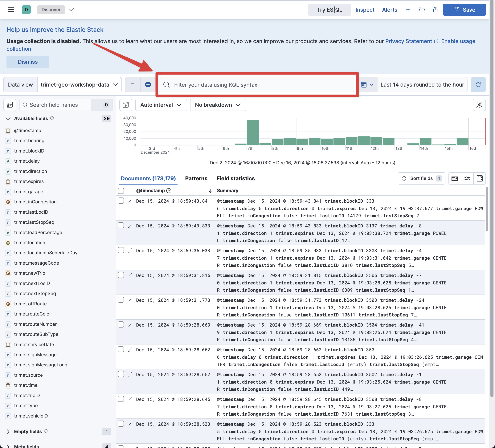
</details>

### Field List
You can explore fields in your data and add those fields to the results display.
<details>
	<summary>Hint</summary>
	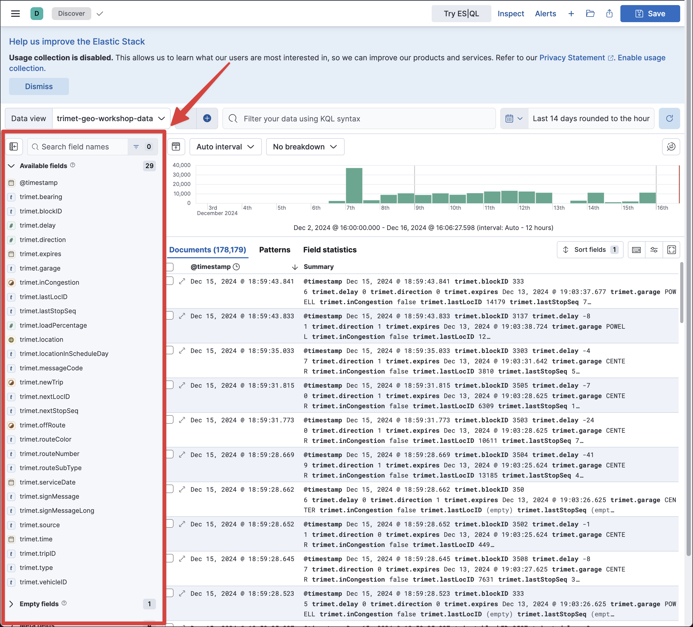
</details>

### Histogram
The histogram shows you the number of records over time that match your query and filters.
<details>
	<summary>Hint</summary>
	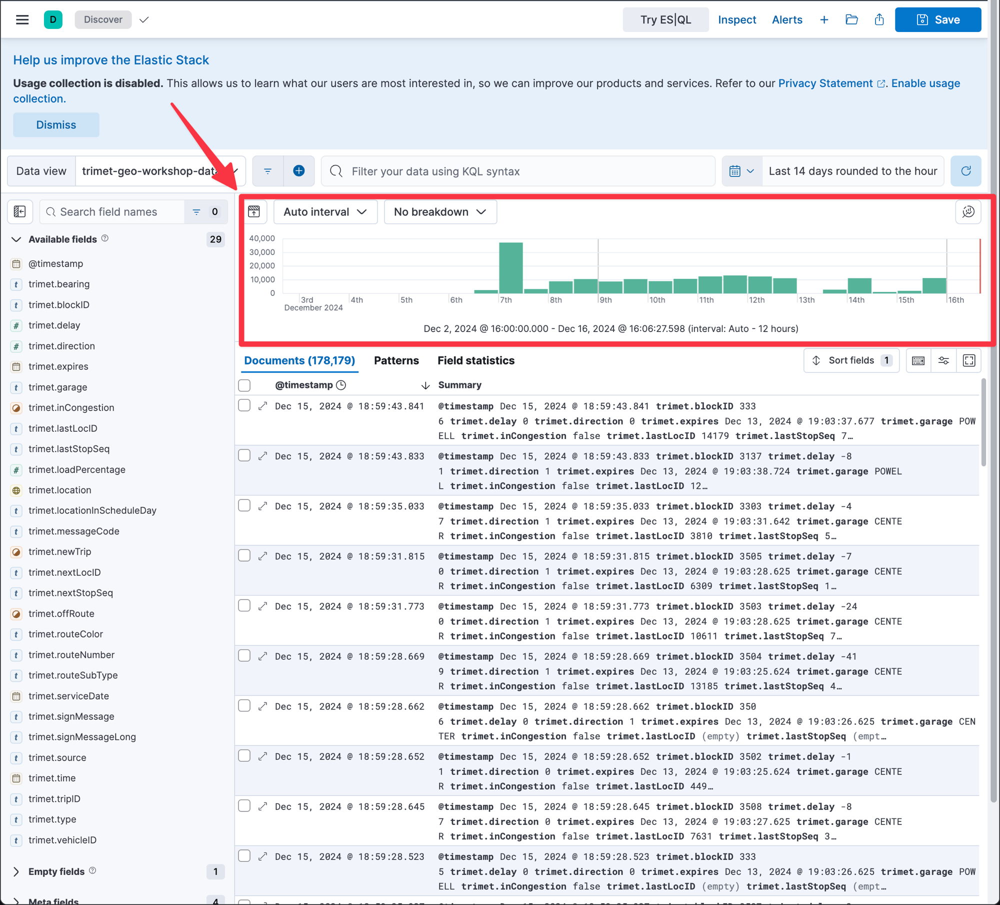
</details>

### Search Results
The search results shows you the record details that match your query and filters.
<details>
	<summary>Hint</summary>
	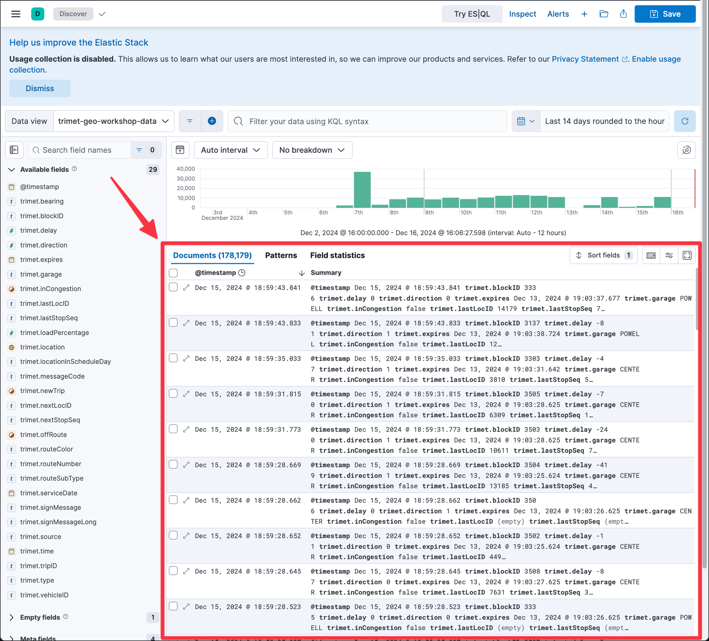
</details>


## Fields and Filters
===

### Field: trimet.vehicleID
The field list allows you to easily find fields present in your data, see metadata about the field values, and quickly filter your data based on the field values.

In the field list, find the field named  `trimet.vehicleID`.

<details>
	<summary>Hint</summary>
	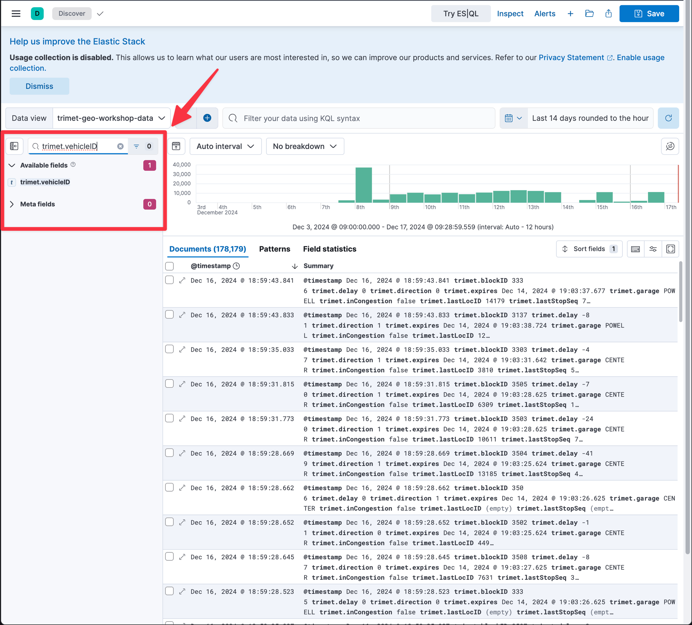
</details>

Click on the field to get a summary of the top values.  What is the `trimet.vehicleID` with the most records?

<details>
	<summary>Hint</summary>
	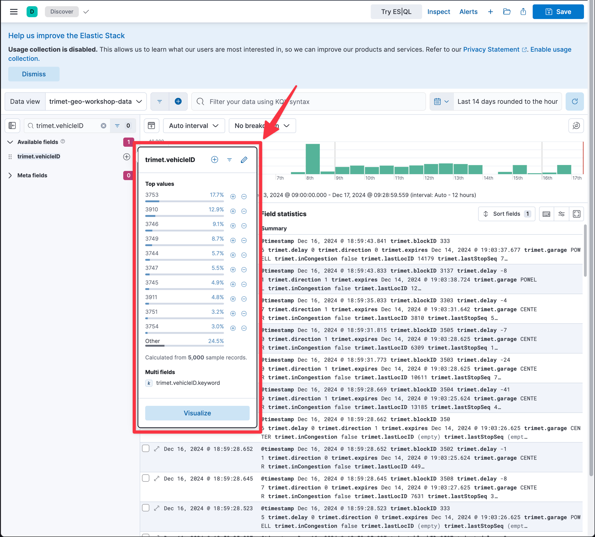
</details>

<details>
	<summary>Answer</summary>
3753
</details>

The summary of top values is based on a sample of records.  How many records were sampled when lookinag at `trimet.vehicleID`?

<details>
	<summary>Hint</summary>
	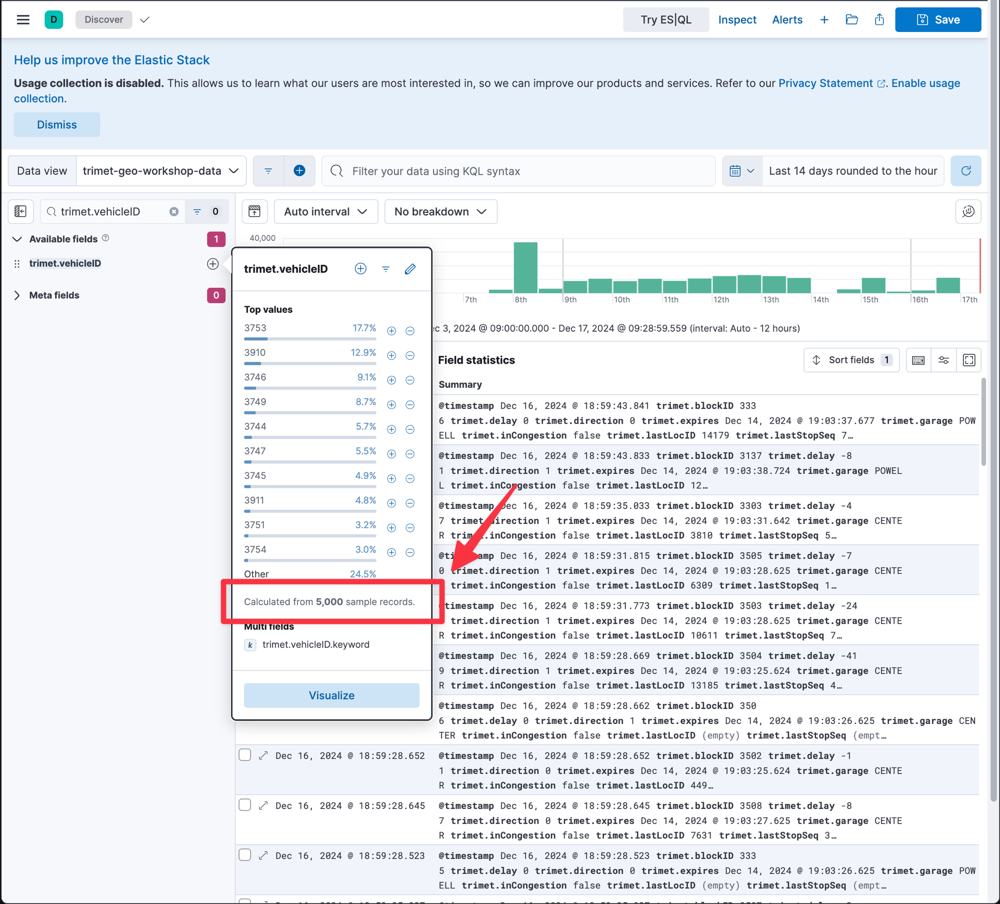
</details>

<details>
	<summary>Answer</summary>
5000
</details>

Filter the results for `trimet.vehicleID` `3753`.  How many records are there?
<details>
	<summary>Hint</summary>
	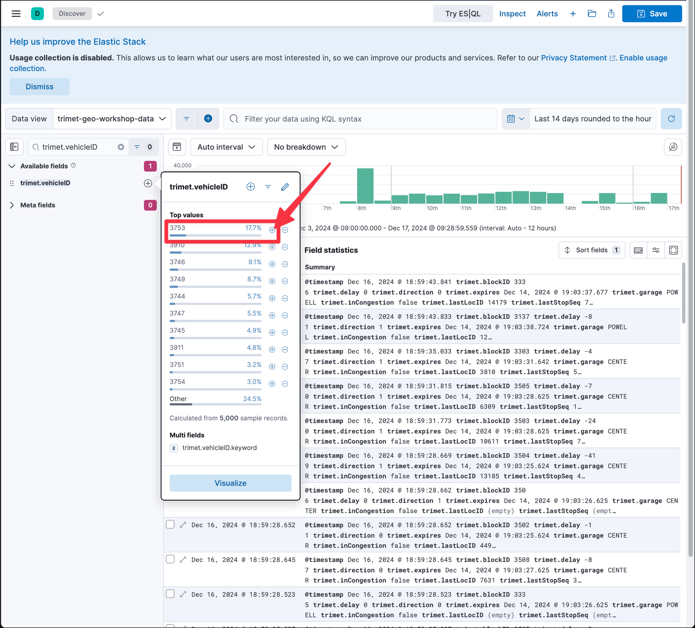
</details>

<details>
	<summary>Hint</summary>
		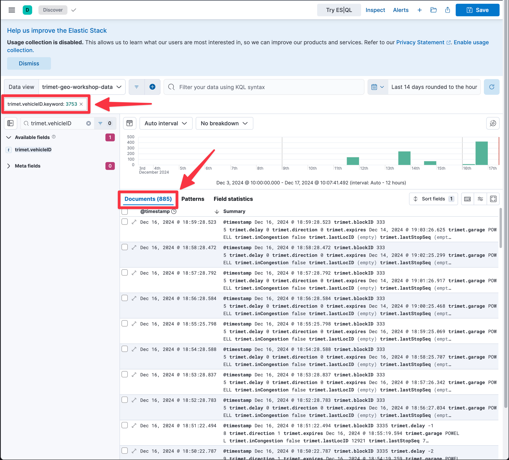
</details>

<details>
	<summary>Answer</summary>
885
</details>


## Date and Time
===


## Saved Searches
===


<details>
	<summary>Hint</summary>
		
</details>

<code><pre>
source-command
| processing-command1
| processing-command2
</pre></code>

```
POST /_query
{
  "query": """
    from apache-logs
    | limit 10
  """
}
```

## Conclusion
===
In this lab, you've learned the basic structure of ES|QL commands and where to run them. This foundational knowledge will be instrumental as you progress through more complex ES|QL features in upcoming labs.

Congratulations, you have completed Lab 1. Click the **Next** button to proceed to Lab 2.
