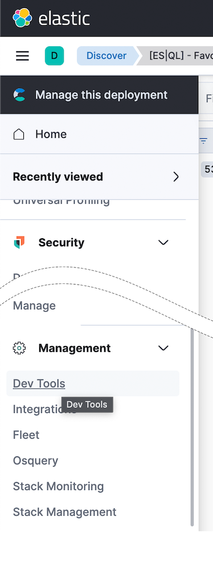

We're excited to have you join us today for the lab portion of the Elasticsearch Geospatial workshop. Whether you're a seasoned data professional or just beginning your data analysis journey, this workshop is designed to give you exposure and knowledge to use Elasticsearch's geospatial capabilities for your data analysis and investigation needs.

Our goal is for you to feel comfortable and confident using Elasticsearch Geospatial features for your data analysis tasks. We want you to leave with a sense of achievement and new skills to apply in your projects.

We hope you enjoy the Elasticsearch Geospatial Workshop Lab.

## What to Expect
===

Throughout the workshop you will see **Hints** or **Answers** like the below:

	
Hint

You can click on these for help.

- Experience: You should have some basic knowledge of Elasticearch and Kibana.
- Lecture: This lab is intended to be accompanied by a lecture discussing an overview of Elastic and Elasticsearch Geospatial features.
- Hands-On Experience: You will have access to Kibana via a tab in the Instruqt lab environment where you will be able to conduct hands-on exercises.
- Total Workshop time: 2-3 Hours

## Lab  List
===

- Elastic Geo Lab 1: Discover: Learn about the Discover app in Kibana.
- Elastic Geo Lab 2: Maps: Learn about the Maps app in Kibana.
- Elastic Geo Lab 3: Dashboards: Learn about Dashboards in Kibana.
- Elastic Geo Lab 4: Machine Learning Anomalies: Learn about geospatial Machine Learning anomalies.
- Elastic Geo Lab 5: Ingest Pipelines:  Learn about Elasticsearch ingest pipelines.
- Elastic Geo Lab 6: ES|QL + Geo: Learn about using ES|QL with Geospatial data.

## Stay Connected
===

This workshop is just the beginning. Stay connected with us for more opportunities to learn about and get hands-on experience with Elastic via future workshops.

Click the **Next** button to proceed to Lab 1.