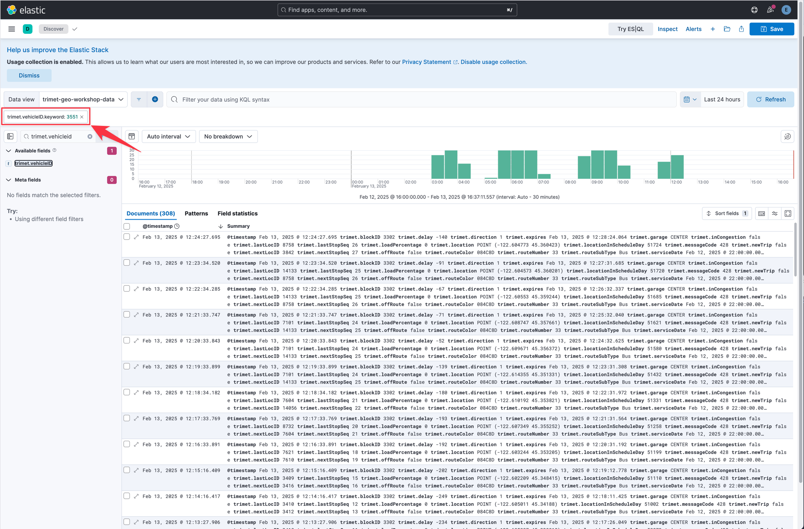
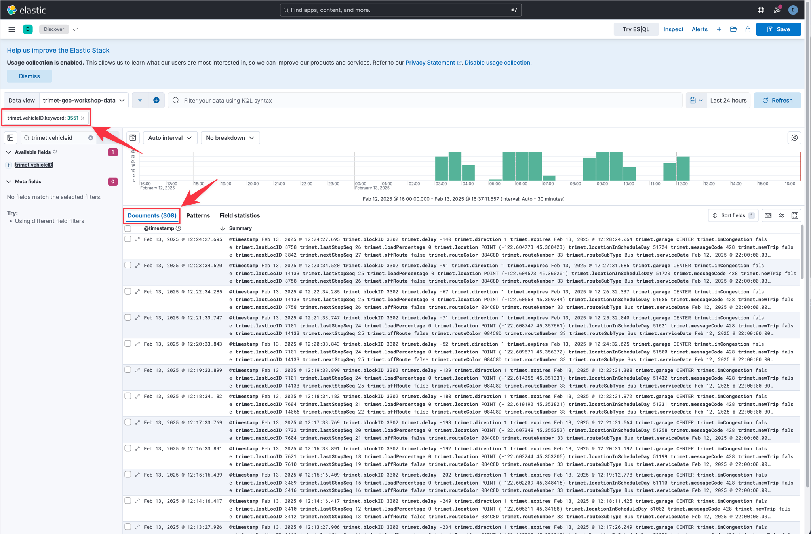
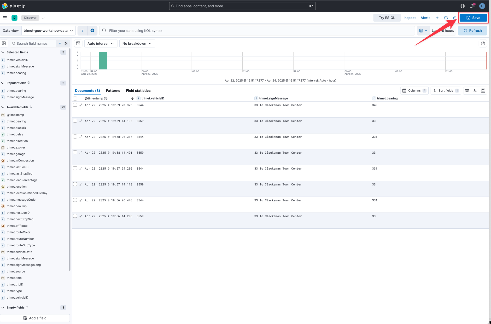

You have questions about your data. What pages on your website contain a specific word or phrase? What events were logged most recently? What processes take longer than 500 milliseconds to respond?

With Discover, you can quickly search and filter your data. You can get information about the structure of the fields in your data. You can also customize and save your searches and place them on a dashboard.

In Lab 1, you will get hands-on experience using Discover to learn about the data in the lab environment. You can find Discover's online documentation here: https://www.elastic.co/guide/en/kibana/current/discover.html.

## Discover Overview
===
This section of the lab provides you an overview of the `Discover` application.

### Data View
Kibana requires a data view to access your Elasticsearch data. A data view can point to one or more indices, data streams, or index aliases. When adding data to Elasticsearch using one of the many integrations available data views are often created automatically, but you can also create your own.

You interact with your data sources in Kibana via `Data Views`. Select the data view to choose which set of data you want to analyze.

	
Hint

	

### Time Picker
You filter your data using dates and times with the `Time Picker`. Select the time range to narrow your view of the data based on date and time.

	
Hint

	

### Search Box
You search for you data using the `Search Box`. You can query for basic terms, fields or a combination of the both in the search box.

	
Hint

	

### Field List
You can explore the fields in your data using the `Field List`. Using the field list, you can add those fields to the results display or filter your data.

	
Hint

	

### Histogram
You can explore the number of records over time using the `Histogram`. This visualization always updates based on your selected time, queries, and filters.

	
Hint

	

### Search Results
Matching records or documents for your queries, filters and time range are displayed in the `Search Results`. The search results shows you the record details and allows you to customize how those records are displayed.

	
Hint

	

## Fields and Filters
===
Kibana enables you to interactively query data in fields to create filters without having to know complex query languages.

### Field: trimet.vehicleID
The field list allows you to easily find fields present in your data, see metadata about the field values, and quickly filter your data based on the field values.

In the field list, find the field named `trimet.vehicleID`.

	
Hint

	

Click on the field name to get a summary of the top values. Which `trimet.vehicleID` with the most records?

	
Hint

	

	
Answer

3551

The summary of top values is based on a sample of records. How many records were sampled when lookinag at `trimet.vehicleID`?

	
Hint

	

	
Answer

3001

Filter the results for `trimet.vehicleID` `3551`. You can do this by clicking the circle-plus icon. How many records are there?

	
Hint

	

	
Hint

		

	
Answer

308

## Date and Time
===
Most data sources will have a timestamp component to them. Kibana enables you to easily filter your data based on the timestamps in the data.

### Time Picker Options
You have already been exposed the `Time Picker` in Kibana. When you click on the calendar icon in the Time Picker, there are 2 groups of preconfigured timestamp ranges. What are those groups?

	
Hint

	

	
Answer

`Commonly used` and `Recently used date ranges`

In the `Commonly used` group of timestamps, what are 2 available selections of timestamps.

	
Hint

	

	
Answer

`Today`, `Last 24 hours`, and `Last 1 year` are some of the preconfigured timestamps.

## Saved Searches
===
A saved search is a convenient way to reuse a search that you’ve created in Discover. Saved Searches are good for adding search results to a dashboard, and can also serve as a foundation for building visualizations. The fields displayed in Discover, filters, search terms and time picker settings are all saved as part of a Save Search.

By default, a saved search stores the query text, filters, and current view of Discover, including the columns and sort order in the document table, and the data view.

### Choosing Displayed Fields
===
By default, Discover shows you a summarized view of documents and records.  Depending on the data, this view may not always be easy to read.  This is where choosing the fields you want to see displayed helps.

To select one more fields to be displayed, hover over or click the name of the field in the Field List.  You should see a `+` icon.

Let's add the `trimet.vehicleID` field to the results display.  Hover over or click on `trimet.vehicleID` in the Field List.  Click the `+` icon to add that field to the display.

What happened to the results display?

	
Hint

You should notice that a new category, `Selected Fields`, was added to the Field List.  This shows you which fields have been added to the results display.  You should also notice the `Summary` field in the results display has been removed and `trimet.vehicleID` was added.

	
Answer

	

Now let's add `trimet.signMessage` to the results display.

	
Hint

You should notice the `trimet.signMessage` field was added to the `Selected Fields` section in the Field List. You should also notice the `trimet.signMessage` field was added to the results display.

	
Answer

	

Now let's add `trimet.bearing` to the results display.

	
Hint

You should notice the `trimet.bearing` field was added to the `Selected Fields` section in the Field List. You should also notice the `trimet.bearing` field was added to the results display.

	
Answer

	

### Saving your search
===
Once you have your field list setup, it's time to save this search for later use.  To save a search, click on the `Save` button in the upper right corner of the Kibana Discover UI.

This is should open the `Save search` diaglog box.

#### Title
===
You can give your saved search a a custom name.  We recommend you use a naming convention that makes it easy to understand the query, filters and data view associated with the data source.

Give your saved search the name "Trimet Saved Search".

	
Hint

	

#### Description
===
You can provide a more detailed description of your saved search.  This is optional, but recommended.

Provide more detailed information such as field names used, time ranges, etc.

	
Hint

	

#### Tags
===
You can select from existing `tags` or create new ones.  This makes it easier to find related content and assets when searching for tags.

We don't yet have any tags in the system.  Click in the tag entry box.  Enter the tag name `trimet`.  To save this tag, create the `Create tag` option.

	
Hint

	

When you click on `Create tag` another diaglog box will be display. This allows you to specify details for your new tag.

	
Hint

	

The color of the tag may not match what is displayed in the screenshot.  Feel free to change the color for the tag.  You also have the ability to provide a description for the tag.  This makes it easy to understand the purpose of the tag and which assets the tag might be associated with.

Click the `Create tag` button to save the tag.

You should notice the original `Saved search` dialog box is displayed.  You should also notice that the tag you created is displayed and color coded.

#### Store Time
===
Sometimes you want to have the time picker associated with your query saved with the search.  You have the option to enable saving the time.

If you are happy with the information you have entered, click on the `Save` button to save your search.  You should notice the Discover window will refresh.  In the upper left corner of Discover, you can see the name of the saved search is now displayed.  This is how you can easily tell if you are viewing a saved search in Discover.

	
Hint

	

## Conclusion
===
In Lab 2 you've learned the basics of using the Discover tool within Kibana to interact with and analyze your data. The Discovery tool is useful for all types of data. Understanding how to use Discovery is foundational knowledge which will be instrumental as you progress through more labs in this workshop and in real world scenarios.

Congratulations, you have completed Lab 1. Click the **Next** button to proceed to the next lab.
