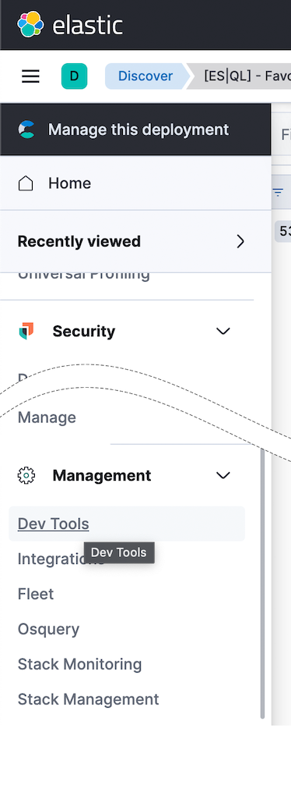

You have questions about your data. What pages on your website contain a specific word or phrase? What events were logged most recently? What processes take longer than 500 milliseconds to respond?

With Discover, you can quickly search and filter your data. You can get information about the structure of the fields in your data. You can also customize and save your searches and place them on a dashboard.

In Lab 1, you will get hands-on experience using Discover to learn about the data in the lab environment. You can find Discover's online documentation here: https://www.elastic.co/guide/en/kibana/current/discover.html.

## Discover Overview
===
Kibana requires a data view to access your Elasticsearch data. A data view can point to one or more indices, data streams, or index aliases. When adding data to Elasticsearch using one of the many integrations available, data views are often created automatically, but you can also create your own.

### Data View
You interact with your data sources in Kibana via `Data Views`. Select the data view to choose which set of data you want to analyze.
<details>
	<summary>Hint</summary>
	
</details>

### Time Picker
You filter your data using dates and times with the `Time Picker`. Select the time range to narrow your view of the data based on date and time.
<details>
	<summary>Hint</summary>
	
</details>

### Search Box
You search for you data using the `Search Box`. You can query for basic terms, fields or a combination of the both in the search box.
<details>
	<summary>Hint</summary>
	
</details>

### Field List
You can explore the fields in your data using the `Field List`. Using the field list, you can add those fields to the results display or filter your data.
<details>
	<summary>Hint</summary>
	
</details>

### Histogram
You can explore the number of records over time using the `Histogram`. This visualization always updates based on your selected time, queries, and filters.
<details>
	<summary>Hint</summary>
	
</details>

### Search Results
Matching records or documents for your queries, filters and time range are displayed in the `Search Results`.  The search results shows you the record details and allows you to customize how those records are displayed.
<details>
	<summary>Hint</summary>
	
</details>


## Fields and Filters
===

### Field: trimet.vehicleID
The field list allows you to easily find fields present in your data, see metadata about the field values, and quickly filter your data based on the field values.

In the field list, find the field named `trimet.vehicleID`.

<details>
	<summary>Hint</summary>
	
</details>

Click on the field name to get a summary of the top values. Which `trimet.vehicleID` with the most records?

<details>
	<summary>Hint</summary>
	
</details>

<details>
	<summary>Answer</summary>
3551
</details>

The summary of top values is based on a sample of records. How many records were sampled when lookinag at `trimet.vehicleID`?

<details>
	<summary>Hint</summary>
	
</details>

<details>
	<summary>Answer</summary>
3001
</details>

Filter the results for `trimet.vehicleID` `3551`. You can do this by clicking the circle-plus icon.  How many records are there?
<details>
	<summary>Hint</summary>
	
</details>

<details>
	<summary>Hint</summary>
		
</details>

<details>
	<summary>Answer</summary>
308
</details>


## Date and Time
===


## Saved Searches
===


<details>
	<summary>Hint</summary>
		
</details>

<code><pre>
source-command
| processing-command1
| processing-command2
</pre></code>

```
POST /_query
{
  "query": """
    from apache-logs
    | limit 10
  """
}
```

## Conclusion
===
In this lab, you've learned the basic structure of ES|QL commands and where to run them. This foundational knowledge will be instrumental as you progress through more complex ES|QL features in upcoming labs.

Congratulations, you have completed Lab 1. Click the **Next** button to proceed to Lab 2.
