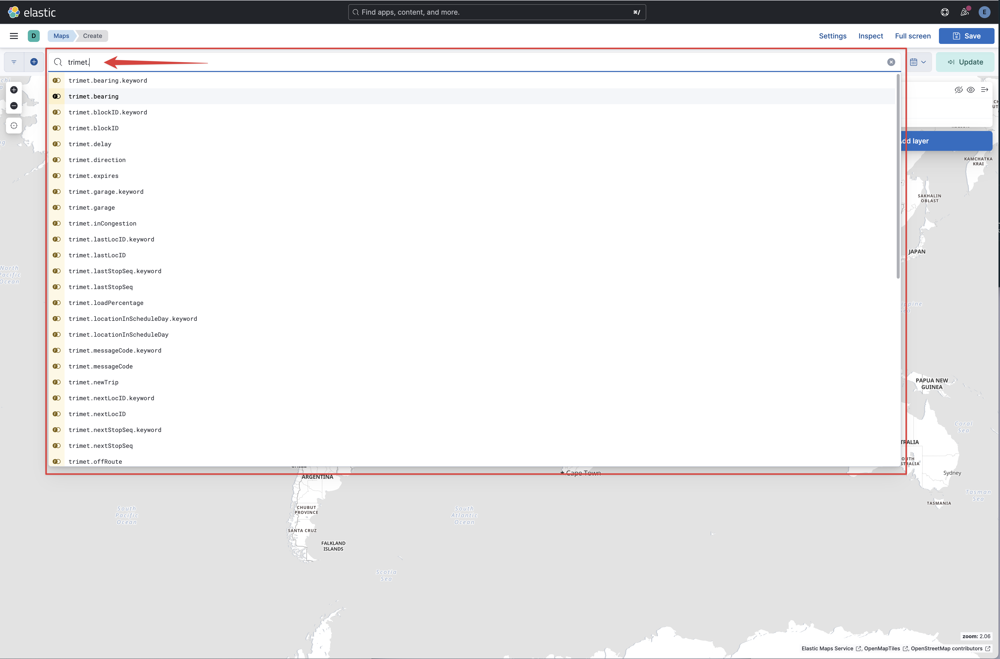
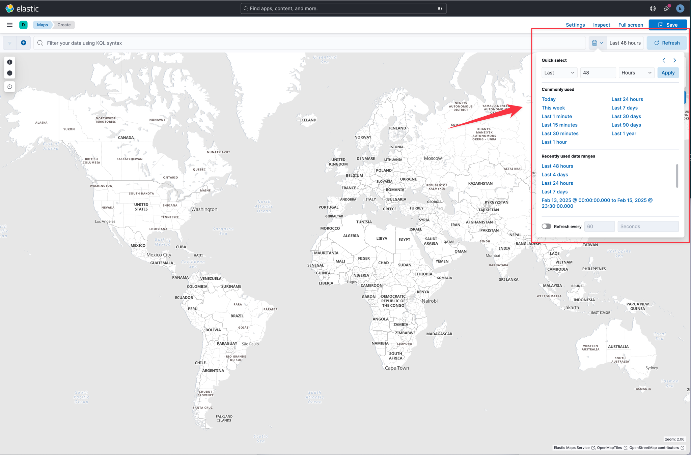
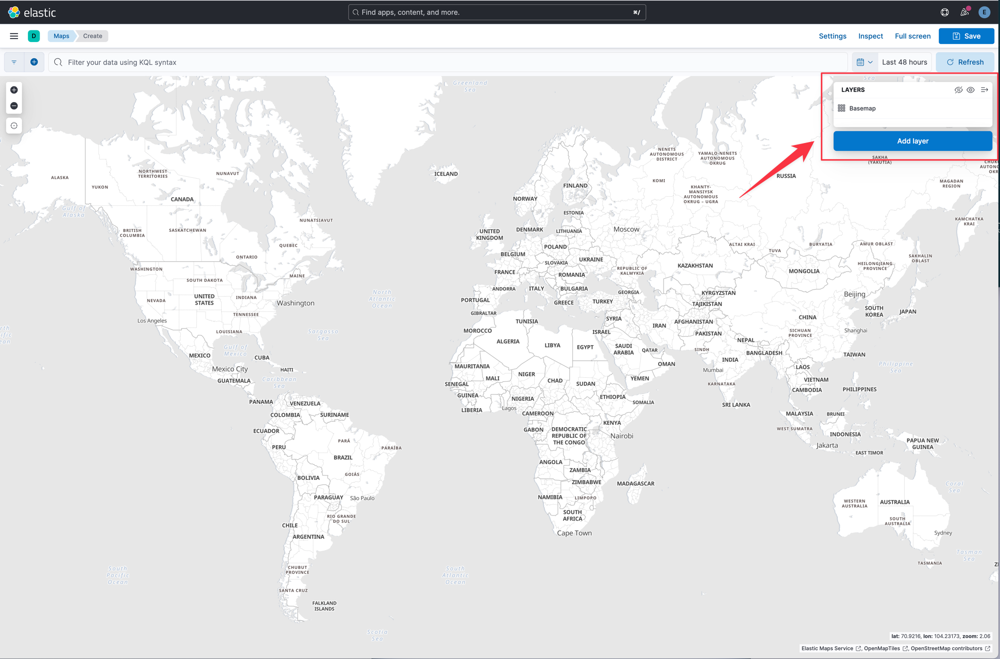
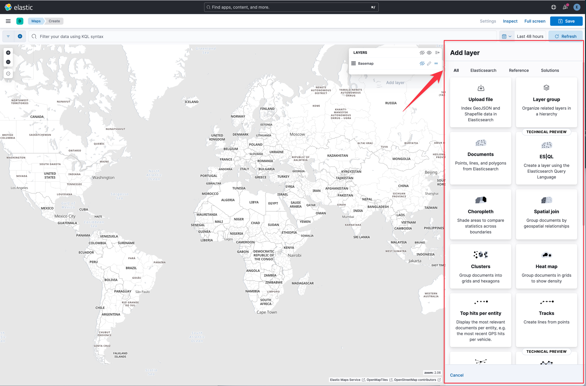
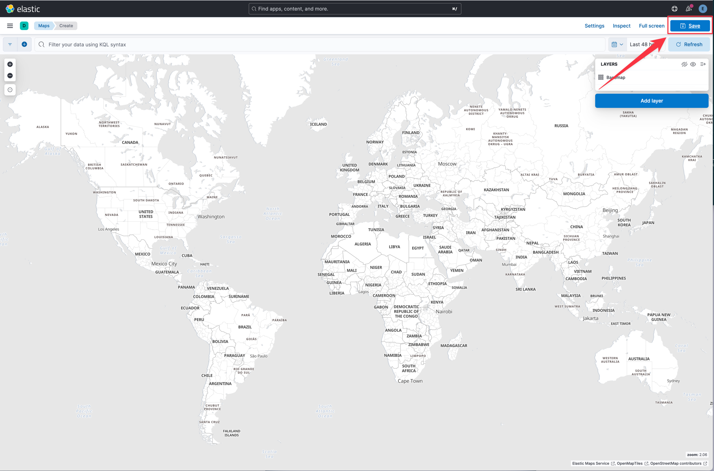
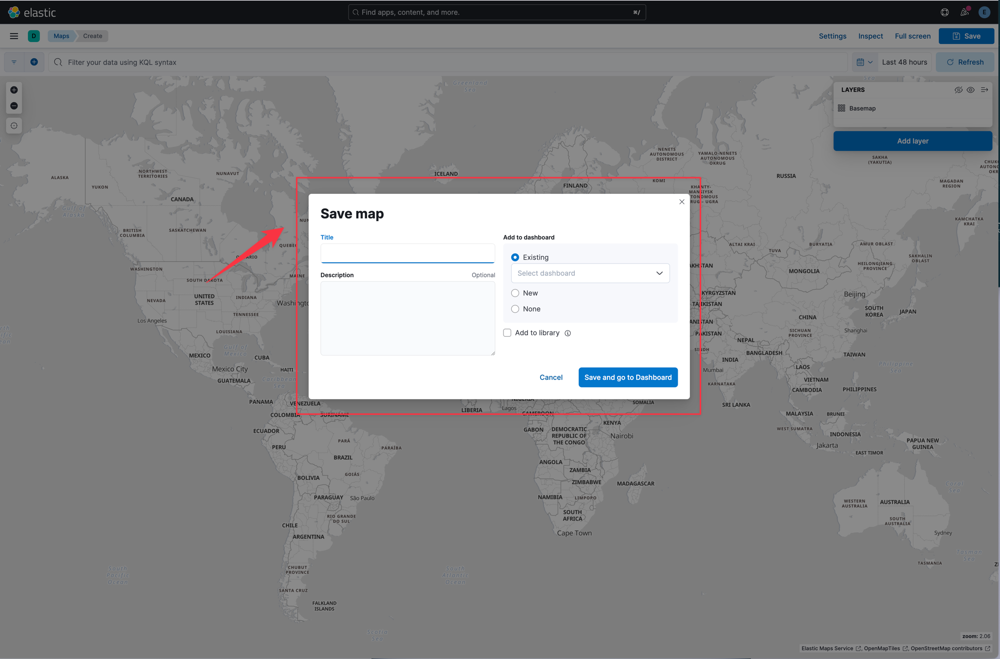

"Where" is a critical question for many users of the Elastic Stack. Whether you're protecting your network from attackers, investigating slow application response times in specific locations, or simply hailing a ride home, geo data — and search — play an important role. The Maps app in Kibana gives you an intuitive way to weave geospatial layers in with your temporal, structured, text, and other Elasticsearch data so you can ask (and answer) meaningful questions.

Elastic Kibana Maps is a feature that allows users to visualize geographical data in Kibana. It enables the creation of maps with multiple layers and indices, allowing users to plot individual documents or use aggregations to plot any dataset, no matter how large.

In Lab 2 you will learn about how to use the Maps app in Kibana.  With Maps, you can:

- Build maps with multiple layers and indices.
- Animate spatial temporal data.
- Upload GeoJSON files and shapefiles.
- Embed your map in dashboards.
- Symbolize features using data values.
- Focus on only the data that’s important to you.

You can find documentation on Kibana Maps here: https://www.elastic.co/docs/explore-analyze/visualize/maps.  There is also a step-by-step tutorial that walks you through tracking, visualizing and alerting on geospatial assets in real time: https://www.elastic.co/guide/en/kibana/8.17/asset-tracking-tutorial.html.

## Maps Overview
===
To access the Maps application in Kibana, click on the main menu icon in the upper left corner.  This is also known as the "hamburger menu."

	
Hint

	

The main menu in Kibana provides you quick access to all of the other applications within Kibana.

	
Hint

	

The main menu groups the various Kibana applications according to use case.  The first group is the `Analytics` group which are applications broadly useful as part of the platform.

	
Hint

	

Within the analytics section you will find the Maps application.  Click on `Maps` to open the Maps application.  The maps applciation will open presenting you with a new basic map.

	
Hint

	

### Filters
The filters widget allows you to add terms to filter in or out of your documents displayed on the map.  This widget functions the same as it does in the Discover app.

	
Hint

	

If you click on the `+` icon, you can easily create new filters by using the provided query builder without having to understand complex query syntax.

	
Hint

	

### Query Input
The query input box allows you to create more flexible queries than filters alone.  This widget functions the same as it does in the Discover app.

	
Hint

	

When you click in the query input box, the Maps app will show you a list of available fields.  This makes it easy to get started exploring your data when you aren't familiar with it.

	
Hint

	

Type `trimet` into the query input box. You should notice that the field is auotmatically updated as you type.  The list of fields displayed should now be filtered to only display fields that begin with `trimet.`.

	
Hint

	

### Time Picker
You filter your data using dates and times with the `Time Picker`. Select the time range to narrow your view of the data based on date and time.  This widget functions the same as it does in the Discovery app.

	
Hint

	

### Layers
The Map app allows you to create layers for your data.  To avoid overwhelming the user with too much data at once, you can add mutiple two layers for your Elasticsearch data. One layer can display individual documents when users zoom in on the map. Another layer will display aggregated data when users zoom the map out.

	
Hint

	

Click on the `Add layer` button.

	
Hint

	

You should notice a panel open that contains multiple options for adding layers to your map.

### Save
The save button allows you to save your maps.  This enables you to load maps within the Maps app in addition to adding maps to Dashboards.

	
Hint

	

Click on the `Save` button.

	
Hint

	

You should notice the `Save maps` dialog box opens.  The dialog box gives you options for `Title`, `Description`, `Add to ashboard` and `Add to library`.  The `Title` enables you to give your map a unqiue, meaningful name.  The optional `Description` allows you to provide more detailed information informing other users about intent and data used in the map.  When saving a map, you have the option to add it to an exiting dashboard, a new dashboard, or not at all.  The option to save to the library allows other users to query for saved visualization and discover your map for usage in their dashboards.

## Create a Map
Now that you have an overview of the Maps app, let's create a new map.

### Add a layer
The first step in creating a map is to add a layer.  Click on the `Add layer` button.

--- WORK IN PROGRESSS ---

## Conclusion
===
In lab 2 you learned about ...

Congratulations, you have completed Lab 2. Click the **Next** button to proceed to the next lab.