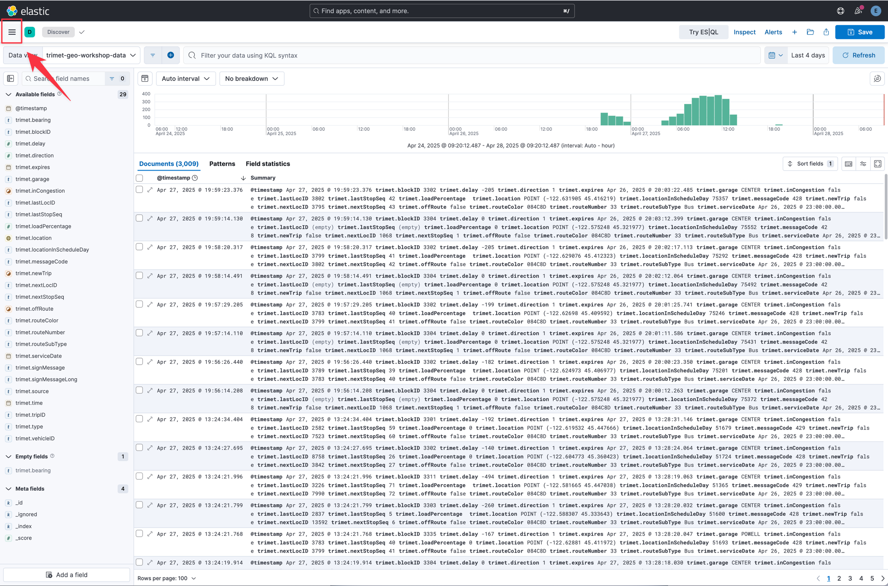
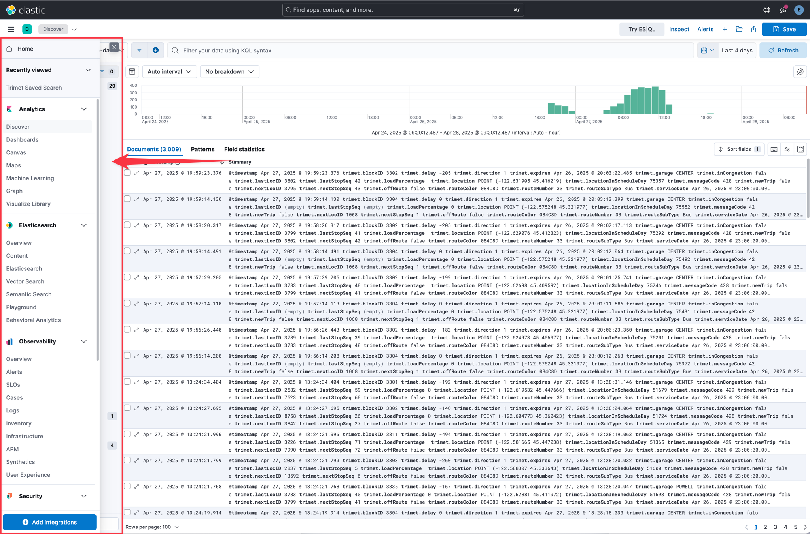
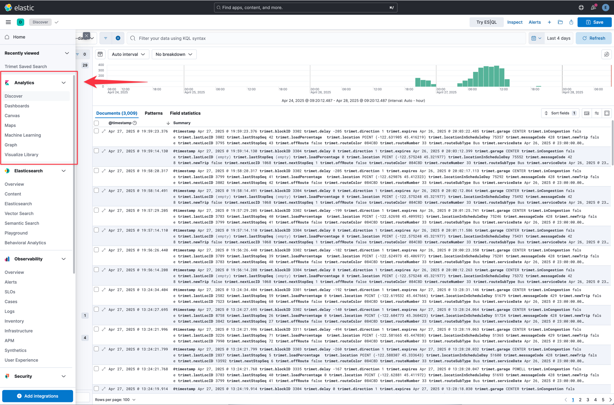
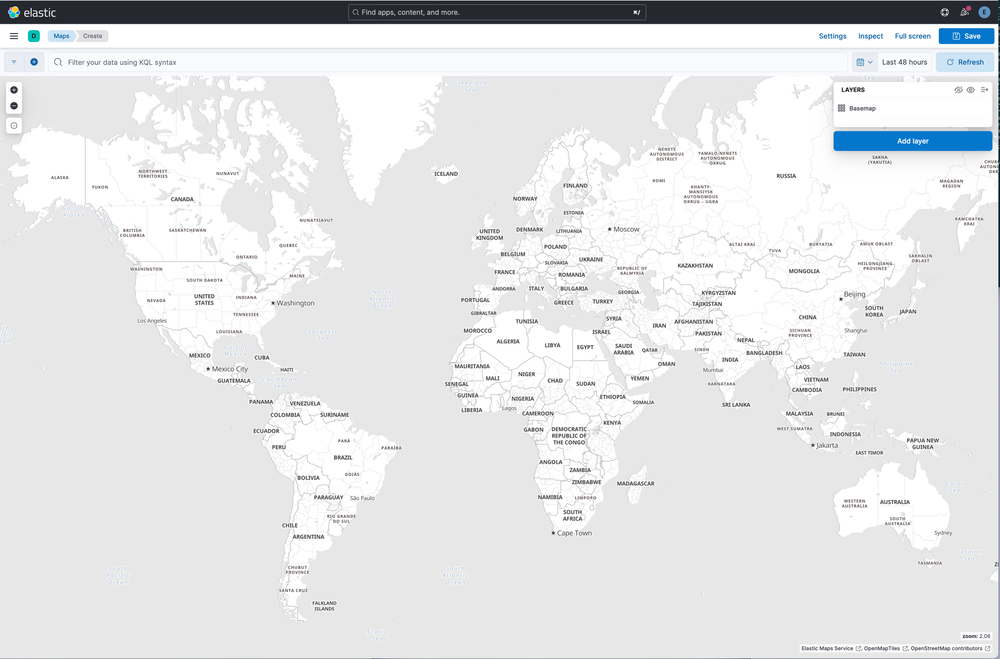
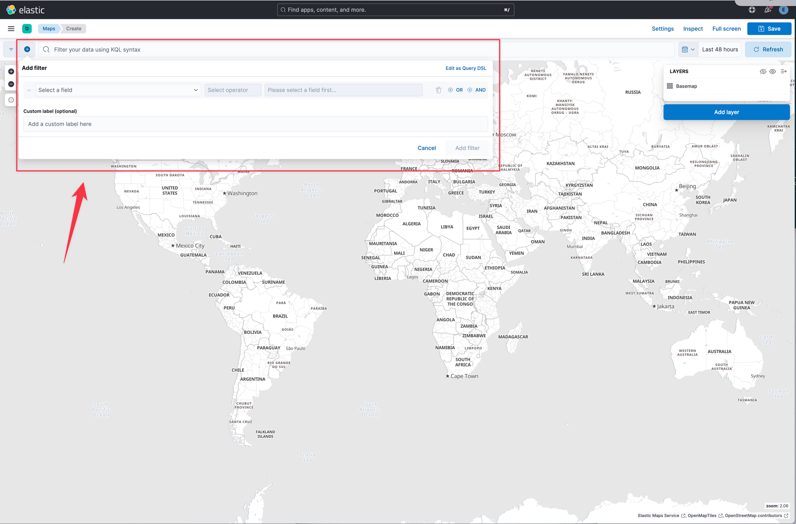
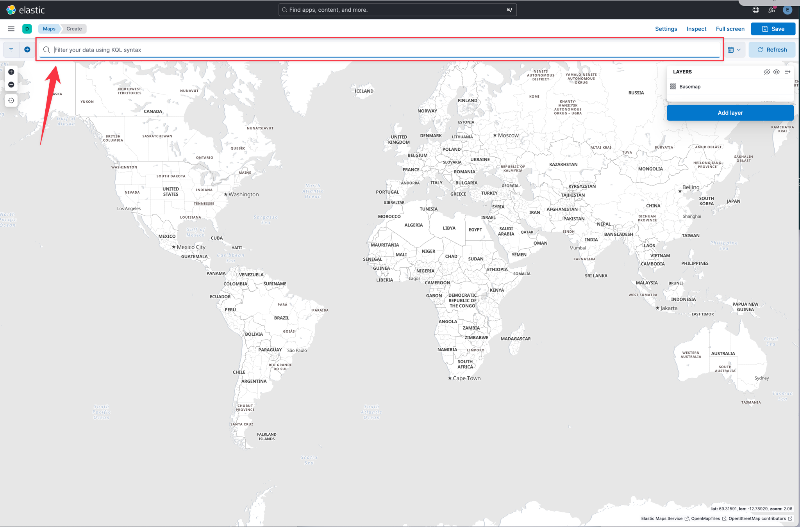

"Where" is a critical question for many users of the Elastic Stack. Whether you're protecting your network from attackers, investigating slow application response times in specific locations, or simply hailing a ride home, geo data — and search — play an important role. The Maps app in Kibana gives you an intuitive way to weave geospatial layers in with your temporal, structured, text, and other Elasticsearch data so you can ask (and answer) meaningful questions.

Elastic Kibana Maps is a feature that allows users to visualize geographical data in Kibana. It enables the creation of maps with multiple layers and indices, allowing users to plot individual documents or use aggregations to plot any dataset, no matter how large.

In Lab 2 you will learn about how to use the Maps app in Kibana.  With Maps, you can:

- Build maps with multiple layers and indices.
- Animate spatial temporal data.
- Upload GeoJSON files and shapefiles.
- Embed your map in dashboards.
- Symbolize features using data values.
- Focus on only the data that’s important to you.

You can find documentation on Kibana Maps here: https://www.elastic.co/docs/explore-analyze/visualize/maps

## Maps Overview
===
To access the Maps application in Kibana, click on the main menu icon in the upper left corner.  This is also known as the "hamburger menu."

	
Hint

	

The main menu in Kibana provides you quick access to all of the other applications within Kibana.

	
Hint

	

The main menu groups the various Kibana applications according to use case.  The first group is the `Analytics` group which are applications broadly useful as part of the platform.

	
Hint

	

Within the analytics section you will find the Maps application.  Click on `Maps` to open the Maps application.  The maps applciation will open presenting you with a new basic map.

	
Hint

	

### Filters
The filters widget allows you to add terms to filter in or out of your documents displayed on the map.

	
Hint

	

If you click on the `+` icon, you can easily create new filters by using the provided query builder without having to understand complex query syntax.

	
Hint

	

### Query Input
The query input box allows you to create more flexible queries than filters alone.

	
Hint

	

## Conclusion
===
In lab 2 you learned about ...

Congratulations, you have completed Lab 2. Click the **Next** button to proceed to the next lab.